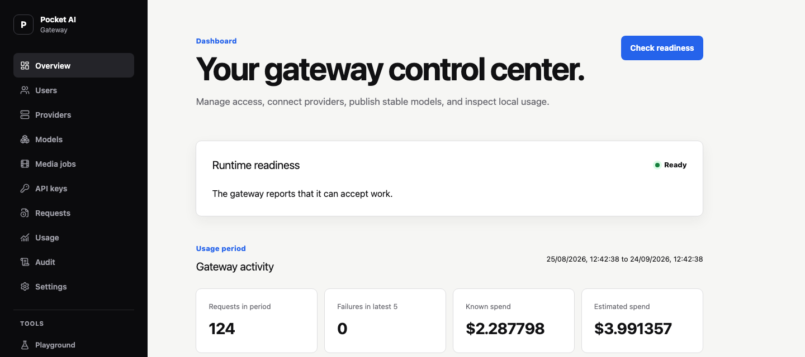

# Pocket AI Gateway

A self-hosted gateway for OpenAI, Anthropic, and Gemini clients. One Go process serves the API and admin dashboard, stores configuration and usage in local SQLite, and routes requests through model names you control.



*The embedded dashboard with disposable example data. [See more screens and run the demo](docs/guides/demo.md).*

## Try it locally

With Docker Compose installed:

```sh
git clone https://github.com/bobalazek/pocket-ai-gateway.git
cd pocket-ai-gateway
docker compose up --build -d
```

Open [http://localhost:8080/_/](http://localhost:8080/_/) and create the first owner account. In the dashboard:

1. Add a provider connection and its credential.
2. Add an upstream model with Chat capability, then publish `assistant` as a public model with Chat capability.
3. Create an API key with `chat:generate`, a model pattern matching `assistant`, and the provider connection ID. The secret is shown once.

```sh
export POCKET_AI_GATEWAY_KEY="paste-your-key"
curl http://localhost:8080/api/openai/v1/chat/completions \
  -H "Authorization: Bearer $POCKET_AI_GATEWAY_KEY" \
  -H 'Content-Type: application/json' \
  -d '{"model":"assistant","messages":[{"role":"user","content":"Hello"}]}'
```

Use the model ID you published in place of `assistant`. Compose binds to localhost and keeps data in named volumes. For a remote server, follow the [deployment guide](docs/guides/deployment.md) to add HTTPS, set the public URL in a Compose override, and configure encrypted backups.

## What it does

- **Separate client APIs.** OpenAI, Anthropic, and Gemini SDKs connect through their own URL namespaces. Supported operations have tested request, response, and streaming behavior.
- **One model name, multiple targets.** Publish stable model IDs and route them with fixed, fallback, weighted, cost, or observed-latency strategies.
- **Keys and limits.** Manage users and scoped API keys, then apply request, token, concurrency, quota, and spend policies by instance, user, key, or provider connection.
- **Usage you can trace.** Inspect attempts, token and cache usage, search-call fees, price versions, cost restatements, and audit events in the dashboard.
- **Local operations.** Provider secrets are encrypted. The server includes backup and restore tools, local or S3-compatible scheduled backups, and no public telemetry.
- **More than text.** The tested subset includes image and audio operations, live WebSocket transports, durable media jobs, and trusted JavaScript transforms for custom adapters.

Built-in presets include OpenAI, Anthropic, Gemini, OpenRouter, Z.AI, MiniMax, Ollama, Together, and Replicate. A preset does not imply that every model supports every operation. See the [compatibility matrix](docs/project/compatibility.md) and [provider evidence](docs/project/provider-certification.md) for exact coverage.

## SDK base URLs

| Client | Base URL |
| --- | --- |
| OpenAI | `http://localhost:8080/api/openai/v1` |
| Anthropic | `http://localhost:8080/api/anthropic` |
| Google Gen AI | `http://localhost:8080/api/gemini` with API version `v1beta` |

Application requests use a scoped gateway API key. Dashboard sign-in uses a separate browser session.

## Explore the dashboard

From a source checkout, `./scripts/demo.sh` starts a disposable instance with three mock providers and seven days of synthetic requests. It needs no provider credential and cannot seed an existing data directory. The [demo guide](docs/guides/demo.md) has login instructions and more screenshots.

## Run one executable

To build from source, install Go 1.27.1, Node.js 22 or newer, and pnpm 10.30.3, then run:

```sh
./scripts/build.sh
./dist/pocket-ai-gateway serve
```

The executable contains the dashboard and database migrations. It listens on `127.0.0.1:8080` and stores data in `./pocket_gateway_data` by default. Open `http://127.0.0.1:8080/_/` for first-time setup. Build tools are unnecessary on the runtime host when you copy a binary for the same operating system and architecture.

The [deployment guide](docs/guides/deployment.md) covers Docker, systemd, reverse proxies, backups, and upgrades. Backups require a separate `POCKET_AI_GATEWAY_BACKUP_KEY`; keep that key and a copy of each archive outside the server.

## Documentation

- [API reference and supported operations](docs/reference/api.md)
- [Deployment and recovery](docs/guides/deployment.md)
- [Architecture](docs/architecture/README.md)
- [Contributing](CONTRIBUTING.md) and [security policy](SECURITY.md)

## Project status

Pocket AI Gateway is [MIT-licensed](LICENSE) and under active development. The implemented APIs cover documented, tested subsets of vendor contracts; live provider certification and release signing are pending. See the [release checklist](docs/project/release-checklist.md) for current status.
