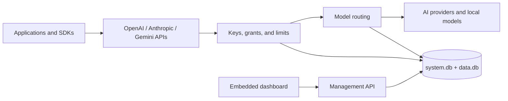

# Pocket AI Gateway

**A self-hosted AI gateway and control panel in one executable.**

Pocket AI Gateway gives applications stable OpenAI, Anthropic, and Gemini APIs while you control the providers behind them. It keeps provider credentials, users, API keys, limits, routing, usage, and audit history on your own server.

The Go server contains the dashboard and database migrations. Build it once, copy the executable and its data directory, and run it without Node.js, a separate database server, Redis, or a hosted control plane.

## Why Pocket AI Gateway

- **Keep existing SDKs.** Give each client its native base URL and keep its request, response, error, and streaming format.
- **Change providers without changing applications.** Publish stable model names and route them to one or more upstream models.
- **Control access and cost.** Issue scoped keys and apply request, token, concurrency, quota, payload, and spend limits.
- **Operate it locally.** Store state in two SQLite databases, keep telemetry private, and back up the complete instance as one encrypted archive.
- **Manage it in the browser.** Onboard the first owner, add users and providers, publish models, inspect requests, and recover the instance from the embedded dashboard.

## Quick start

### Docker

```sh
git clone https://github.com/bobalazek/pocket-ai-gateway.git
cd pocket-ai-gateway
docker compose up --build -d
docker compose logs gateway
```

Open [http://localhost:8080/_/](http://localhost:8080/_/). The data and backup directories live in persistent Docker volumes.

### Standalone executable

Building from source requires Go 1.27.1, Node.js 22 or newer, pnpm 10.30.3, and `curl`:

```sh
git clone https://github.com/bobalazek/pocket-ai-gateway.git
cd pocket-ai-gateway
./scripts/build.sh
./dist/pocket-ai-gateway serve
```

The build creates `dist/pocket-ai-gateway` with the production dashboard embedded. Copy that single file to a machine with the same operating system and architecture; build tools and source files are not needed at runtime.

On a new data directory, the dashboard opens onboarding and the server prints a one-time setup URL. Use it to create the first owner account. Pocket AI Gateway never creates a default password.

## From provider to first request

1. Add a connection and provider credential in **Providers**.
2. Add its upstream models and publish a stable name in **Models**.
3. Select a routing strategy and optional fallback targets.
4. Create a scoped application key in **API keys**.
5. Test the model in **Playground** or point an existing SDK at the matching base URL.

```sh
export POCKET_GATEWAY_KEY="paste-the-key-shown-once"

curl http://127.0.0.1:8080/api/openai/v1/chat/completions \
  -H "Authorization: Bearer $POCKET_GATEWAY_KEY" \
  -H "Content-Type: application/json" \
  -d '{
    "model": "assistant",
    "messages": [{"role": "user", "content": "Hello"}],
    "max_tokens": 128
  }'
```

## Native client APIs

Each protocol has its own namespace. The gateway does not combine unrelated API families at one path.

| Client | Base URL | Authentication |
| --- | --- | --- |
| OpenAI SDK | `http://127.0.0.1:8080/api/openai/v1` | `Authorization: Bearer <key>` |
| Anthropic SDK | `http://127.0.0.1:8080/api/anthropic` | `x-api-key: <key>` |
| Google Gen AI SDK | `http://127.0.0.1:8080/api/gemini`, API version `v1beta` | `x-goog-api-key: <key>` |
| Management API | `http://127.0.0.1:8080/api/v1` | Browser session |

The official OpenAI, Anthropic, and Google Gen AI TypeScript SDKs run in the integration suite. Supported cross-provider generation includes text, image input, JSON schema output, function tools and results, stop sequences, token usage, and compatible incremental streams.

OpenAI Responses supports stateless streaming, local storage, durable background execution, polling, cancellation, input-item listing, deletion, native response compaction on the OpenAI preset, key-owned Conversation resources, and atomic synchronous or background conversation attachment. Embeddings and token counting use native capable targets so the gateway never invents vector spaces or tokenizer results.

See the exact [compatibility matrix](docs/project/compatibility.md) and the [OpenAI](docs/features/openai-compatible.md), [Anthropic](docs/features/anthropic-compatible.md), and [Gemini](docs/features/gemini-compatible.md) API guides.

## Features

| Area | Capabilities |
| --- | --- |
| Providers | OpenAI, Anthropic, Gemini, OpenRouter, Ollama, Mistral, Groq, DeepSeek, xAI, Together, Fireworks, Cohere, Perplexity, Azure OpenAI, Bedrock, Vertex AI, and custom compatible endpoints |
| Routing | Fixed target, ordered fallback, weighted, lowest estimated cost, and observed latency |
| Identity | One recovery owner, multiple administrators and members, browser sessions, owner recovery, and account settings |
| API keys | One-time secret display, scoped operations, model and connection grants, expiration, rotation, and revocation |
| Limits | Instance, user, key, and connection policies for requests, tokens, spend, concurrency, payload size, output tokens, and batch size |
| Accounting | Request and attempt history, token usage, price versions, unknown-cost review, and safe repricing |
| Operations | Status and diagnostics, typed configuration export/import, encrypted local or S3-compatible backups, verified restore, and audit events |
| Privacy | Local state, encrypted provider credentials, no public telemetry, and no ordinary prompt capture |

Provider presets describe the operations that are allowed to route to each service. A preset is not a claim that every upstream model supports every feature. Live provider certification is recorded separately from deterministic protocol tests.

## How it fits together



Runtime state defaults to `./pocket_gateway_data`:

```text
pocket_gateway_data/
  system.db
  data.db
  master.key
  instance.lock
```

Keep the whole directory private and persistent. `master.key` protects provider credentials and must stay with the databases for recovery.

## Deploy and operate

The [deployment guide](docs/guides/deployment.md) covers the standalone executable, Docker Compose, systemd, Caddy/TLS, persistent storage, multi-platform images, configuration, backups, restore, and upgrades. The [operations guide](docs/guides/operations.md) covers recovery keys, scheduled local and S3-compatible backups, retention, health checks, maintenance, and incident recovery.

For a source deployment, the complete release check is:

```sh
./scripts/verify.sh
```

Create checksummed platform archives with:

```sh
./scripts/package.sh v0.1.0
```

The release workflow produces Linux, macOS, and Windows archives for amd64 and arm64, plus checksums, an SBOM, attestations, and Linux amd64/arm64 container images.

## Documentation

- [Getting around the documentation](docs/README.md)
- [Deployment](docs/guides/deployment.md)
- [Operations and recovery](docs/guides/operations.md)
- [API reference](docs/reference/api.md)
- [Provider adapters](docs/guides/adapters.md)
- [Architecture](docs/architecture/README.md)
- [Security policy](SECURITY.md)
- [Contributing](CONTRIBUTING.md)
- [Agent-readable help](llms.txt)

## Status

Pocket AI Gateway is under active development. The compatibility matrix records the behavior covered by deterministic tests and the boundaries that remain. No paid-provider certification is claimed until it is run and recorded against a release artifact.

## License

[MIT](LICENSE)
