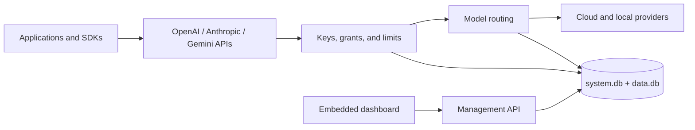

# Pocket AI Gateway

**The PocketBase approach to running an AI gateway: one Go executable, an embedded dashboard, and local SQLite storage.**

Pocket AI Gateway is an open-source, self-hosted control plane for AI applications. Point existing OpenAI, Anthropic, or Gemini clients at protocol-specific gateway URLs, publish stable model names, and decide which provider serves each request.

Provider credentials, users, application keys, limits, routing rules, usage, and audit history stay on infrastructure you control. The production dashboard and database migrations are compiled into the server, so the deployed runtime does not need Node.js, Redis, or a separate database service.

## What you get

- **Native client contracts:** separate OpenAI, Anthropic, and Gemini API namespaces with compatible requests, responses, errors, and streams.
- **Provider routing:** fixed, fallback, weighted, lowest-cost, and observed-latency strategies behind stable public model names.
- **Access control:** multiple administrators and members, scoped application keys, model and provider grants, expiration, rotation, and revocation.
- **Usage controls:** normalized token/cache usage, versioned cache-aware pricing, recurring UTC price windows, and request, concurrency, payload, batch, quota, and spend policies at the instance, user, key, and connection levels.
- **Local operations:** two SQLite databases, encrypted provider secrets, diagnostics, audit events, encrypted backups, restore validation, and no public telemetry.
- **Verified upgrades:** manual or Docker image replacement, plus optional signed dry-run/apply self-update for standalone Linux amd64/arm64 releases.
- **Built-in dashboard:** onboarding, status, users, providers, models, API keys, requests, usage, audit history, backups, settings, and personal account management.

## Run it

### Docker Compose

```sh
git clone https://github.com/bobalazek/pocket-ai-gateway.git
cd pocket-ai-gateway
docker compose up --build -d
docker compose logs gateway
```

Open [http://localhost:8080/_/](http://localhost:8080/_/). Compose keeps `/data` and the default `/data_backups` directory in separate persistent named volumes.

The image starts the gateway by default. Set `POCKET_AI_GATEWAY_PUBLIC_URL` to the external HTTPS origin when deploying behind a proxy.

Run the container backup/restore journey locally with `./scripts/compose-e2e.sh`. It builds the production image, completes onboarding, creates an encrypted paired-store backup, restores it into a clean volume, and verifies the restored account after restart.

### Build once, run one executable

Building from source requires Go 1.27.1, Node.js 22 or newer, pnpm 10.30.3, and `curl`:

```sh
git clone https://github.com/bobalazek/pocket-ai-gateway.git
cd pocket-ai-gateway
./scripts/build.sh
./dist/pocket-ai-gateway serve
```

`dist/pocket-ai-gateway` contains the Go server, production dashboard, and migrations. Copy it to a machine with the same operating system and architecture; build tools and repository files are not required at runtime.

The server listens on `127.0.0.1:8080` and stores state in `./pocket_gateway_data` by default. Run `pocket-ai-gateway help` for configuration flags and commands.

## First-time setup

When the data directory has no users, the dashboard opens the setup flow. Create the owner account directly in the browser; Pocket AI Gateway never creates a default email or password.

Then use the dashboard to:

1. Add a provider connection and credential.
2. Register an upstream model and publish a stable model name.
3. Choose a routing strategy and optional fallback targets.
4. Create a scoped application key. Its secret is shown once.
5. Test the model in **Playground** or update an application's base URL.

```sh
export POCKET_GATEWAY_KEY="paste-the-key-shown-once"

curl http://127.0.0.1:8080/api/openai/v1/chat/completions \
  -H "Authorization: Bearer $POCKET_GATEWAY_KEY" \
  -H "Content-Type: application/json" \
  -d '{
    "model": "assistant",
    "messages": [{"role": "user", "content": "Hello"}],
    "max_tokens": 128
  }'
```

## Bring your existing SDK

Each API family has a stable namespace, so an SDK never has to guess which protocol it is speaking.

| Client | Base URL | Authentication |
| --- | --- | --- |
| OpenAI SDK | `http://127.0.0.1:8080/api/openai/v1` | `Authorization: Bearer <key>` |
| Anthropic SDK | `http://127.0.0.1:8080/api/anthropic` | `x-api-key: <key>` |
| Google Gen AI SDK | `http://127.0.0.1:8080/api/gemini`, API version `v1beta` | `x-goog-api-key: <key>` |
| Management API | `http://127.0.0.1:8080/api/v1` | Browser session |

The integration suite runs the official OpenAI, Anthropic, and Google Gen AI TypeScript SDKs against the gateway. Cross-provider generation covers text, image input, JSON schema output, function tools and results, stop sequences, token usage, and compatible streaming.

Gemini clients can also call synchronous stateless text Interactions at `/api/gemini/v1beta/interactions`. The gateway forces provider storage off, routes only to explicitly capable native Gemini models, preserves completed or incomplete Interaction responses, normalizes the public model name, and includes provider-reported thinking tokens in output-cost accounting.

OpenAI Responses includes non-retained JSON and streaming requests, local Response storage, durable background execution, polling, cancellation, input-item listing, deletion, native compaction on the OpenAI preset, native input-token counting, key-owned Conversations, and atomic synchronous, background, or buffered-stream conversation attachment. A successful attached stream stores its Conversation turn before replay; a failed terminal stream leaves the Conversation unchanged. Bounded native web search is available for non-streaming Responses on an OpenAI-adapter target using the built-in `openai` preset with explicit capability, scope, output, and call ceilings; token usage and search calls are tracked separately while provider search cost remains unknown. Gateway-owned file search uses same-key local Vector Stores, a bounded private tool loop on one native OpenAI or OpenAI-compatible Responses target, official `file_search_call` output, and aggregate provider usage in stateless, stored, or background JSON. Legacy `POST /completions` supports native JSON and SSE on an explicitly capable OpenAI or OpenAI-compatible target. It requires `completions:generate`, validates the official request contract before dispatch, limits the request body, JSON response, and each SSE event to 16 MiB, reserves output across every prompt and generated candidate, and normalizes the public model alias without translating legacy prompt semantics. Embeddings, moderations, token counting, bounded image generation, GPT Image edits, DALL-E 2 variations, buffered text-to-speech, and multipart audio transcription and translation route only to targets that support those operations. DALL-E 2 edits remain unsupported because they use a different multipart contract.

Anthropic Messages also supports bounded native basic web search on the built-in `anthropic` preset. JSON and SSE requests may include one direct `web_search_20250305` tool with `max_uses` from 1 through 4, optional domain controls, and approximate user location. The public and upstream models need `chat` and `web_search`, and the key needs `chat:generate` plus `messages:web_search`. Native server-tool and result blocks, citations, encrypted result state, `pause_turn`, and reported search calls are preserved. In SSE, result blocks arrive complete while tool input and cited text may arrive as deltas; the final `message_delta` carries cumulative usage. The gateway does not translate or fall back after dispatch; lowest-cost, free-only, and spend policies reject these requests because provider search cost remains unknown.

Bounded native Anthropic web fetch accepts one `web_fetch_20250910` tool in an ordinary JSON or SSE Message. Requests require 1–4 fetches and an approximate 1–16,384 fetched-text token limit, may restrict up to ten plain hostnames, and may enable citations. The model needs `chat` and `web_fetch`; the key needs `chat:generate` and `messages:web_fetch`. Provider result/error blocks and reported `web_fetch_requests` remain native, and actual fetched tokens use ordinary versioned model prices. Binary PDFs are not bounded by the text limit, so token/spend policies, lowest-cost routing, and free-only routing reject fetch requests before dispatch. The gateway never translates or retries the request after dispatch. Prompt caching, combined search and fetch, later fetch versions, and local Message Batches remain separate contracts.

Gateway-owned Anthropic Message Batches accept one to four ordinary non-streaming Messages requests in a 16 MiB submission. The creating key owns the batch and needs `chat:generate` plus `messages:batches`; each item uses the same local authorization, routing, limits, and accounting path as an ordinary Message. Invalid nested `params` become asynchronous per-item errors. Until every item finishes, all requests remain in the `processing` count and terminal counters stay at zero. Clients can create, poll, list, cancel, delete, and stream out-of-order results as JSONL. `expires_at` is the 24-hour processing deadline; 29 days after creation the gateway deletes the entire batch and its results. This bounded local contract does not claim Anthropic's provider-owned 100,000-request limit or native 50% batch discount.

Gateway-owned OpenAI Batches use the official SDK's create, retrieve, list, and cancel methods. Upload a Batch JSONL File with `files:manage`, then create the Batch with `batches:manage` plus the matching endpoint scope for `/v1/responses`, `/v1/chat/completions`, `/v1/completions`, `/v1/embeddings`, `/v1/moderations`, `/v1/images/generations`, or `/v1/images/edits`. The bounded local contract accepts one to four non-streaming requests for one public model, processes them through ordinary gateway routing, limits, accounting, and prices, and writes successful and failed JSONL lines to separate same-key output Files. Legacy Completions require `completions:generate` and reuse the direct request validator; Embeddings keep their vector contract; Moderations use native routing and expose no aggregate usage; image generation and edits use native image routing and preserve the standard response body. Batch image edits accept HTTPS or bounded PNG/JPEG/WebP data-URL references; provider `file_id` references remain unsupported. Aggregate usage is available only when terminal Batch usage is complete; otherwise it is null. Processing expires after 24 hours; Batch metadata remains available for 30 days, and generated Files remain for 30 days by default or a requested shorter interval. This local queue does not claim OpenAI's provider-owned 50% discount, separate rate pool, 50,000-request or 200 MB limits, or unlimited output tokens.

Gateway-owned OpenAI Vector Stores support the official SDK's store lifecycle plus atomic create-with-files, file batches, attach, retrieve, update, list, and detach operations for same-key local Files. Resources require `vector_stores:manage`, support bounded metadata and optional expiry, report attached file counts and bytes, and share retained-storage ceilings. UTF-8/ASCII, BOM-marked UTF-16, HTML, DOCX, PPTX, and XLSX content can be retrieved and searched lexically, including through bounded Responses `file_search`. Static token chunking, PDF/legacy Office parsing, and embedding-backed semantic search remain pending.

See the tested [compatibility matrix](docs/project/compatibility.md) and the [OpenAI](docs/features/openai-compatible.md), [Anthropic](docs/features/anthropic-compatible.md), and [Gemini](docs/features/gemini-compatible.md) guides for exact behavior and limits.

## Providers and models

Built-in provider presets cover OpenAI, Anthropic, Gemini, OpenRouter, Ollama, Mistral, Groq, DeepSeek, xAI, Together, Fireworks, Cohere, Perplexity, Azure OpenAI, Amazon Bedrock, and Google Vertex AI. Custom OpenAI-compatible endpoints are supported too.

A preset defines connection behavior and available operations. Actual capability still depends on the chosen upstream model. Live certification is tracked separately from deterministic protocol tests, so the project does not claim a provider works until the tested release records it.

Provider secrets can be encrypted locally or read from environment and mounted-file references. Bearer references let Azure Entra and Google Cloud identity agents rotate short-lived tokens without restarting the gateway.

## Dashboard and operations

The embedded dashboard provides:

| Area | Capabilities |
| --- | --- |
| Overview | Service health, traffic, latency, errors, token usage, and estimated cost |
| Access | Users, roles, sessions, recovery, application keys, scopes, and grants |
| Providers | Connections, encrypted credentials, health checks, upstream models, and public models |
| Routing | Target order, weights, fallback, cost routing, latency routing, and free-only policies |
| Limits | Request, token, spend, concurrency, quota, payload, output, and batch controls |
| Activity | Requests, attempts, tool-call metadata, accounting status, and audit history |
| Maintenance | Configuration export/import, encrypted local or S3-compatible backups, restore, retention, and diagnostics |

Ordinary prompt and response content is not captured in request logs. Conversation and stored Response content is retained only when the client explicitly uses those API features.

## Runtime layout



The default data directory contains:

```text
pocket_gateway_data/
  system.db
  data.db
  master.key
  instance.lock
```

Keep the entire directory private and persistent. `master.key` protects provider credentials and is required with the databases for recovery. A data directory may be opened by only one gateway process at a time.

## Deploy and upgrade

The [deployment guide](docs/guides/deployment.md) covers the standalone executable, Docker Compose, systemd, Caddy and TLS, persistent storage, multi-platform images, configuration, backup, restore, and upgrades. The [operations guide](docs/guides/operations.md) covers recovery keys, scheduled local and S3-compatible backups, retention, health checks, maintenance, and incident recovery.

Run the complete source and release check with:

```sh
./scripts/verify.sh
```

Create checksummed platform archives with:

```sh
./scripts/package.sh v0.1.0
```

The release workflow builds Linux archives and container images for amd64 and arm64, plus checksums, an SBOM, and attestations. Docker is the primary deployment path.

## Documentation

- [Documentation index](docs/README.md)
- [Deployment](docs/guides/deployment.md)
- [Operations and recovery](docs/guides/operations.md)
- [API reference](docs/reference/api.md)
- [Provider adapters](docs/guides/adapters.md)
- [Architecture](docs/architecture/README.md)
- [Security policy](SECURITY.md)
- [Contributing](CONTRIBUTING.md)
- [Agent-readable help](llms.txt)

## Project status

Pocket AI Gateway is under active development. Before v1.0, releases may include breaking configuration or API changes. Consult the compatibility matrix for behavior covered by tests and the provider certification records for live upstream results.

## License

[MIT](LICENSE)
