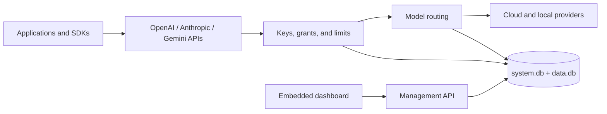

# Pocket AI Gateway

**The PocketBase approach to running an AI gateway: one Go executable, an embedded dashboard, and local SQLite storage.**

Pocket AI Gateway is an open-source, self-hosted control plane for AI applications. Point existing OpenAI, Anthropic, or Gemini clients at protocol-specific gateway URLs, publish stable model names, and decide which provider serves each request.

Provider credentials, users, application keys, limits, routing rules, usage, and audit history stay on infrastructure you control. The production dashboard and database migrations are compiled into the server, so the deployed runtime does not need Node.js, Redis, or a separate database service.

## What you get

- **Native client contracts:** separate OpenAI, Anthropic, and Gemini API namespaces with compatible requests, responses, errors, and streams.
- **Provider routing:** fixed, fallback, weighted, lowest-cost, and observed-latency strategies behind stable public model names.
- **Access control:** multiple administrators and members, scoped application keys, model and provider grants, expiration, rotation, and revocation.
- **Usage controls:** request, token, concurrency, payload, batch, quota, and spend policies at the instance, user, key, and connection levels.
- **Local operations:** two SQLite databases, encrypted provider secrets, diagnostics, audit events, encrypted backups, restore validation, and no public telemetry.
- **Built-in dashboard:** onboarding, status, users, providers, models, API keys, requests, usage, audit history, backups, settings, and personal account management.

## Run it

### Docker Compose

```sh
git clone https://github.com/bobalazek/pocket-ai-gateway.git
cd pocket-ai-gateway
docker compose up --build -d
docker compose logs gateway
```

Open [http://localhost:8080/_/](http://localhost:8080/_/). Compose keeps gateway data and backups in persistent named volumes.

### Build once, run one executable

Building from source requires Go 1.27.1, Node.js 22 or newer, pnpm 10.30.3, and `curl`:

```sh
git clone https://github.com/bobalazek/pocket-ai-gateway.git
cd pocket-ai-gateway
./scripts/build.sh
./dist/pocket-ai-gateway serve
```

`dist/pocket-ai-gateway` contains the Go server, production dashboard, and migrations. Copy it to a machine with the same operating system and architecture; build tools and repository files are not required at runtime.

The server listens on `127.0.0.1:8080` and stores state in `./pocket_gateway_data` by default. Run `pocket-ai-gateway help` for configuration flags and commands.

## First-time setup

When the data directory has no users, the dashboard opens the setup flow and the server prints a one-time setup URL. Use it to create the owner account. Pocket AI Gateway never creates a default email or password.

Then use the dashboard to:

1. Add a provider connection and credential.
2. Register an upstream model and publish a stable model name.
3. Choose a routing strategy and optional fallback targets.
4. Create a scoped application key. Its secret is shown once.
5. Test the model in **Playground** or update an application's base URL.

```sh
export POCKET_GATEWAY_KEY="paste-the-key-shown-once"

curl http://127.0.0.1:8080/api/openai/v1/chat/completions \
  -H "Authorization: Bearer $POCKET_GATEWAY_KEY" \
  -H "Content-Type: application/json" \
  -d '{
    "model": "assistant",
    "messages": [{"role": "user", "content": "Hello"}],
    "max_tokens": 128
  }'
```

## Bring your existing SDK

Each API family has a stable namespace, so an SDK never has to guess which protocol it is speaking.

| Client | Base URL | Authentication |
| --- | --- | --- |
| OpenAI SDK | `http://127.0.0.1:8080/api/openai/v1` | `Authorization: Bearer <key>` |
| Anthropic SDK | `http://127.0.0.1:8080/api/anthropic` | `x-api-key: <key>` |
| Google Gen AI SDK | `http://127.0.0.1:8080/api/gemini`, API version `v1beta` | `x-goog-api-key: <key>` |
| Management API | `http://127.0.0.1:8080/api/v1` | Browser session |

The integration suite runs the official OpenAI, Anthropic, and Google Gen AI TypeScript SDKs against the gateway. Cross-provider generation covers text, image input, JSON schema output, function tools and results, stop sequences, token usage, and compatible streaming.

OpenAI Responses includes non-retained JSON and streaming requests, local Response storage, durable background execution, polling, cancellation, input-item listing, deletion, native compaction on the OpenAI preset, key-owned Conversations, and atomic synchronous, background, or buffered-stream conversation attachment. A successful attached stream stores its Conversation turn before replay; a failed terminal stream leaves the Conversation unchanged. Embeddings, moderations, and token counting route only to targets that support those operations.

See the tested [compatibility matrix](docs/project/compatibility.md) and the [OpenAI](docs/features/openai-compatible.md), [Anthropic](docs/features/anthropic-compatible.md), and [Gemini](docs/features/gemini-compatible.md) guides for exact behavior and limits.

## Providers and models

Built-in provider presets cover OpenAI, Anthropic, Gemini, OpenRouter, Ollama, Mistral, Groq, DeepSeek, xAI, Together, Fireworks, Cohere, Perplexity, Azure OpenAI, Amazon Bedrock, and Google Vertex AI. Custom OpenAI-compatible endpoints are supported too.

A preset defines connection behavior and available operations. Actual capability still depends on the chosen upstream model. Live certification is tracked separately from deterministic protocol tests, so the project does not claim a provider works until the tested release records it.

## Dashboard and operations

The embedded dashboard provides:

| Area | Capabilities |
| --- | --- |
| Overview | Service health, traffic, latency, errors, token usage, and estimated cost |
| Access | Users, roles, sessions, recovery, application keys, scopes, and grants |
| Providers | Connections, encrypted credentials, health checks, upstream models, and public models |
| Routing | Target order, weights, fallback, cost routing, latency routing, and free-only policies |
| Limits | Request, token, spend, concurrency, quota, payload, output, and batch controls |
| Activity | Requests, attempts, tool-call metadata, accounting status, and audit history |
| Maintenance | Configuration export/import, encrypted local or S3-compatible backups, restore, retention, and diagnostics |

Ordinary prompt and response content is not captured in request logs. Conversation and stored Response content is retained only when the client explicitly uses those API features.

## Runtime layout



The default data directory contains:

```text
pocket_gateway_data/
  system.db
  data.db
  master.key
  instance.lock
```

Keep the entire directory private and persistent. `master.key` protects provider credentials and is required with the databases for recovery. A data directory may be opened by only one gateway process at a time.

## Deploy and upgrade

The [deployment guide](docs/guides/deployment.md) covers the standalone executable, Docker Compose, systemd, Caddy and TLS, persistent storage, multi-platform images, configuration, backup, restore, and upgrades. The [operations guide](docs/guides/operations.md) covers recovery keys, scheduled local and S3-compatible backups, retention, health checks, maintenance, and incident recovery.

Run the complete source and release check with:

```sh
./scripts/verify.sh
```

Create checksummed platform archives with:

```sh
./scripts/package.sh v0.1.0
```

The release workflow builds Linux, macOS, and Windows archives for amd64 and arm64, plus checksums, an SBOM, attestations, and Linux amd64/arm64 container images.

## Documentation

- [Documentation index](docs/README.md)
- [Deployment](docs/guides/deployment.md)
- [Operations and recovery](docs/guides/operations.md)
- [API reference](docs/reference/api.md)
- [Provider adapters](docs/guides/adapters.md)
- [Architecture](docs/architecture/README.md)
- [Security policy](SECURITY.md)
- [Contributing](CONTRIBUTING.md)
- [Agent-readable help](llms.txt)

## Project status

Pocket AI Gateway is under active development. Before v1.0, releases may include breaking configuration or API changes. Consult the compatibility matrix for behavior covered by tests and the provider certification records for live upstream results.

## License

[MIT](LICENSE)
