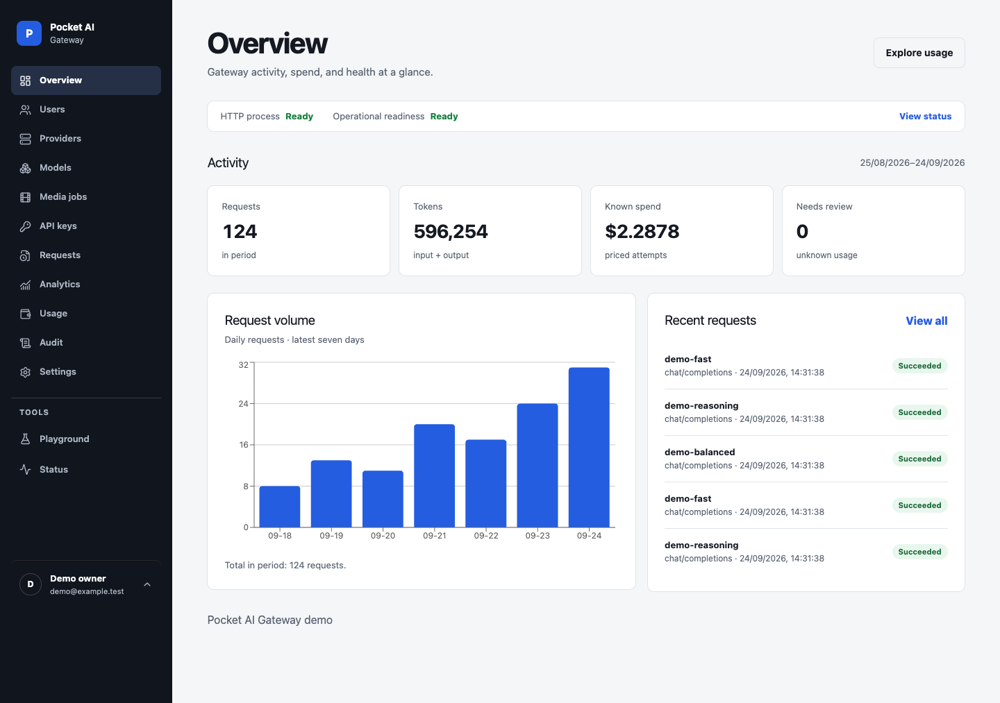
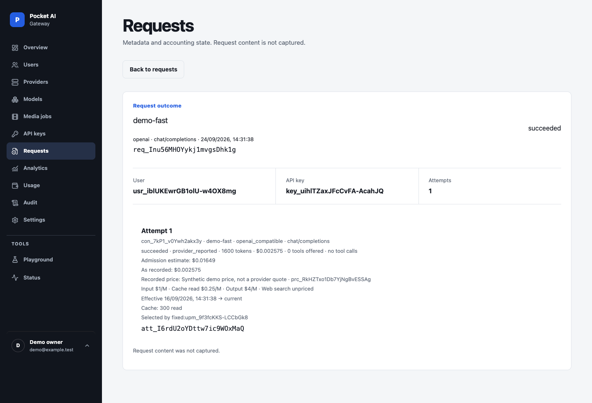
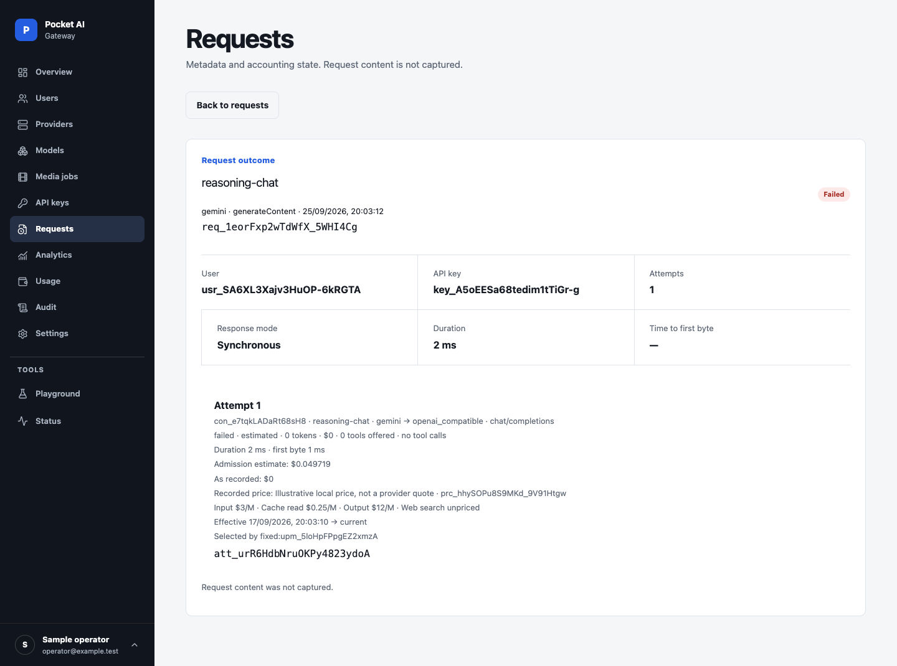
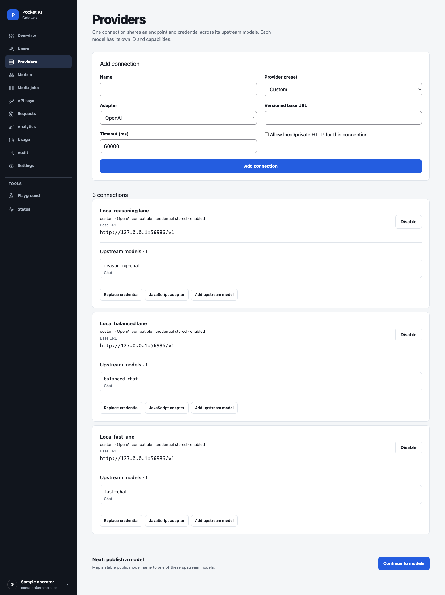
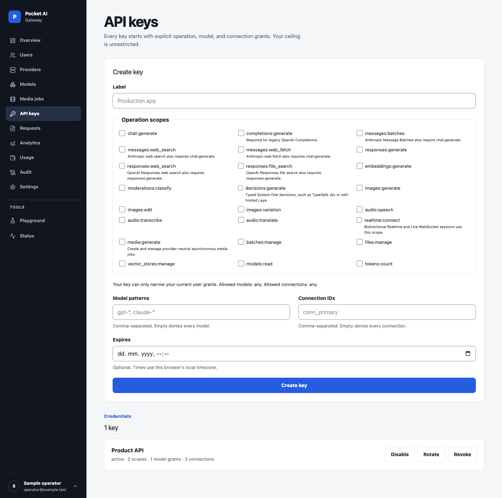
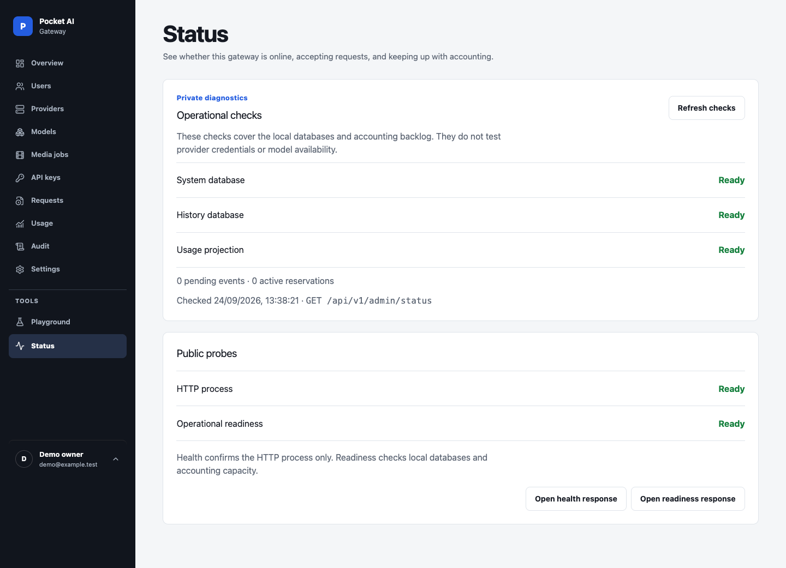
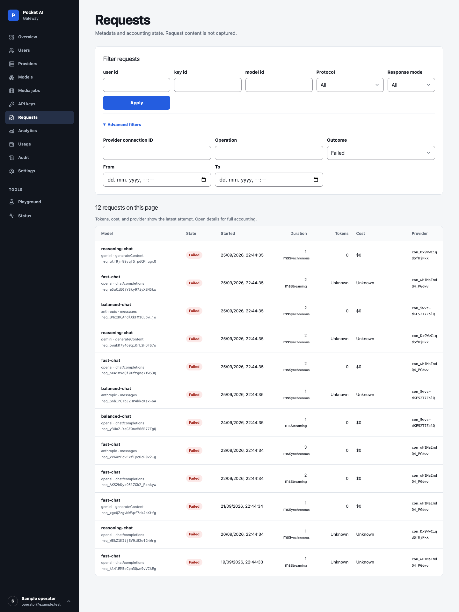

# Pocket AI Gateway

A self-hosted gateway for OpenAI, Anthropic, Gemini, and System One decision clients. One Go process serves the API and admin dashboard, stores configuration and usage in local SQLite, and routes requests through model names you control.

> [!WARNING]
> **Alpha software.** Pocket AI Gateway is open source, provided under the [MIT license](LICENSE) without warranty, and still in alpha. It has automated tests but has not been proven under sustained production load, audited by a third party, or certified against live provider accounts. It can have bugs that affect routing, limits, or usage and cost accounting, so spend limits and rate limits are not a guarantee against provider charges. Test it with your own providers and low provider-side spending caps before relying on it, keep backups, and do not expose it to untrusted users yet.

[](docs/images/demo-page-overview.png)

*The embedded dashboard with disposable example data. [Browse the desktop and mobile gallery](docs/guides/demo.md#screenshots).*

## Try it locally

The gateway is a single process and a single container. With Docker installed:

```sh
git clone https://github.com/bobalazek/pocket-ai-gateway.git
cd pocket-ai-gateway
docker compose up --build -d
```

Compose only builds that one container and attaches its volumes; the [deployment guide](docs/guides/deployment.md#docker) shows the equivalent `docker run`, and [Run one executable](#run-one-executable) needs no Docker at all.

Open [http://localhost:8080/_/](http://localhost:8080/_/) and create the first owner account. In the dashboard:

1. Add a provider connection and its credential.
2. Add an upstream model with Chat capability, then publish `assistant` as a public model with Chat capability.
3. Create an API key with `chat:generate`, a model pattern matching `assistant`, and the provider connection ID. The secret is shown once.

```sh
export POCKET_AI_GATEWAY_KEY="paste-your-key"
curl http://localhost:8080/api/openai/v1/chat/completions \
  -H "Authorization: Bearer $POCKET_AI_GATEWAY_KEY" \
  -H 'Content-Type: application/json' \
  -d '{"model":"assistant","messages":[{"role":"user","content":"Hello"}]}'
```

Use the model ID you published in place of `assistant`. The [setup guide](docs/guides/setup.md) explains every step, including all key scopes and limits. Compose binds to localhost and keeps data in named volumes. For a remote server, follow the [deployment guide](docs/guides/deployment.md) to add HTTPS, set the public URL in a Compose override, and configure encrypted backups.

## What it does

- **Separate client APIs.** OpenAI, Anthropic, and Gemini SDKs connect through their own URL namespaces. Supported operations have tested request, response, and streaming behavior.
- **One model name, multiple targets.** Publish stable model IDs and route them with fixed, fallback, weighted, cost, or observed-latency strategies.
- **Keys and limits.** Manage users and scoped API keys, then apply request, token, concurrency, quota, and spend policies by instance, user, key, or provider connection.
- **Usage you can trace.** Compare traffic, errors, known spend, total duration, and time to first byte by API key, model, provider, operation, and streaming or synchronous mode; inspect attempts, cache usage, price versions, cost restatements, and audit events. Local status alerts flag sustained failures and backup or storage problems.
- **Local operations.** Provider secrets are encrypted. The server includes backup and restore tools, local or S3-compatible scheduled backups, and no public telemetry.
- **Typed decisions.** System One models such as TypeSafe Jev, Laya, Kev, and OpenJev answer yes/no, choice, and score questions with calibrated probabilities through `/api/systemone`, with the same keys, limits, and accounting. See [System One decisions](docs/features/systemone-compatible.md).
- **More than text.** The tested subset includes image and audio operations, live WebSocket transports, durable media jobs, and trusted JavaScript transforms for custom adapters.

Built-in presets include OpenAI, Anthropic, Gemini, OpenRouter, Z.AI, MiniMax, Ollama, Together, and Replicate, plus System One decision models from TypeSafe (Jev), Vercel AI Gateway, Codiv, Laya, Kev, CLM, and OpenJev. Each preset fills its reviewed provider base URL; one connection can hold many upstream models. A preset does not imply that every model supports every operation. See [provider URLs and evidence](docs/project/provider-certification.md), the [Replicate model guide](docs/guides/adapters.md), and the [compatibility matrix](docs/project/compatibility.md).

## SDK base URLs

| Client | Base URL |
| --- | --- |
| OpenAI | `http://localhost:8080/api/openai/v1` |
| Anthropic | `http://localhost:8080/api/anthropic` |
| Google Gen AI | `http://localhost:8080/api/gemini` with API version `v1beta` |
| TypeSafe (System One) | `http://localhost:8080/api/systemone` |

Application requests use a scoped gateway API key. Dashboard sign-in uses a separate browser session.

## Explore the dashboard

These screens use synthetic traffic in a disposable local instance. No real provider credential or paid AI request is involved; a deployed gateway shows its own data. Run `./scripts/demo.sh` to explore it, or browse the [full screenshot gallery](docs/guides/demo.md#screenshots).

| Request detail | Failed request |
| --- | --- |
| [](docs/images/demo-page-request-detail.png) | [](docs/images/demo-page-failed-request.png) |

| Providers | API keys |
| --- | --- |
| [](docs/images/demo-page-providers.png) | [](docs/images/demo-page-keys.png) |

| Status and alerts | Failed requests |
| --- | --- |
| [](docs/images/demo-page-status.png) | [](docs/images/demo-page-request-errors.png) |

Longer pages open at full size: [Analytics](docs/images/demo-page-analytics.png) (traffic, spend, p95 duration, and time to first byte by key, model, provider, operation, and response mode), [Usage and limits](docs/images/demo-page-usage.png), [Request history](docs/images/demo-page-requests.png), [Models and routing](docs/images/demo-page-models.png), and [Audit log](docs/images/demo-page-audit.png). The [OpenAI](docs/images/demo-page-providers-preset-openai.png) and [Replicate](docs/images/demo-page-providers-preset-replicate.png) preset pages show the base URL and supported operations each preset fills in; selecting a preset does not connect or call its provider.

## Download a release

[GitHub Releases](https://github.com/bobalazek/pocket-ai-gateway/releases) provide Linux amd64 and arm64 binaries, `SHA256SUMS`, a signed release manifest, and an SPDX SBOM. For example:

```sh
version=0.1.0-alpha.1
curl -fLO "https://github.com/bobalazek/pocket-ai-gateway/releases/download/v$version/pocket-ai-gateway-$version-linux-amd64.tar.gz"
curl -fLO "https://github.com/bobalazek/pocket-ai-gateway/releases/download/v$version/SHA256SUMS"
sha256sum --check --ignore-missing SHA256SUMS
tar -xzf "pocket-ai-gateway-$version-linux-amd64.tar.gz"
./pocket-ai-gateway-linux-amd64 serve
```

The release signing key is listed in [SECURITY.md](SECURITY.md). Container images will follow on GitHub Container Registry; until then, build the image as shown above.

## Run one executable

To build from source, install Go 1.27.1, Node.js 26, and pnpm 10.30.3, then run:

```sh
./scripts/build.sh
./dist/pocket-ai-gateway serve
```

The executable contains the dashboard and database migrations. It listens on `127.0.0.1:8080` and stores data in `./pocket_gateway_data` by default. Open `http://127.0.0.1:8080/_/` for first-time setup. Build tools are unnecessary on the runtime host when you copy a binary for the same operating system and architecture.

The [deployment guide](docs/guides/deployment.md) covers Docker, systemd, reverse proxies, backups, and upgrades. Backups require a separate `POCKET_AI_GATEWAY_BACKUP_KEY`; keep that key and a copy of each archive outside the server.

## Documentation

- [Set up a gateway](docs/guides/setup.md): roles, providers, models, prices, API key scopes, and limits
- [Client skill for AI agents](skills/pocket-ai-gateway/SKILL.md)
- [API reference and supported operations](docs/reference/api.md)
- [Deployment and recovery](docs/guides/deployment.md)
- [Architecture](docs/architecture/README.md)
- [Contributing](CONTRIBUTING.md) and [security policy](SECURITY.md)

## Project status

Pocket AI Gateway is [MIT-licensed](LICENSE) alpha software under active development; see the warning at the top. The implemented APIs cover documented, tested subsets of vendor contracts, and live provider certification is pending. See the [release checklist](docs/project/release-checklist.md) for current status.
