# Try the dashboard with example data

From a source checkout with the [build prerequisites](deployment.md#build-once-deploy-one-executable), run:

```sh
./scripts/demo.sh
```

The command builds the embedded dashboard and starts a demo at `http://127.0.0.1:18084/_/`. Sign in with `demo@example.test` and the temporary password printed in the terminal. Use `./scripts/demo.sh --port 0` to select an available port automatically.

The demo contains three synthetic users, three mock provider connections, three public models, three scoped keys, illustrative token prices, and 124 requests spread across seven days. Requests pass through the real gateway authorization, routing, accounting, and history projection paths; the local mock supplies the text and token counts. Timestamps are shifted only inside the disposable fixture to populate the charts. The prices and usage are examples, not provider quotes or performance measurements.

## Screenshots

These are full-page browser captures of the embedded dashboard, with a 1440-pixel desktop viewport and a 390-pixel mobile viewport. Every account, provider, key, request, and price shown comes from the disposable demo. Prices are examples, not provider quotes.

Select an image to open the full-resolution capture.

### Traffic and cost

| Overview | Usage and limits |
| --- | --- |
| [](../images/demo-page-overview.png)<br>The home screen summarizes requests and known example spend. | [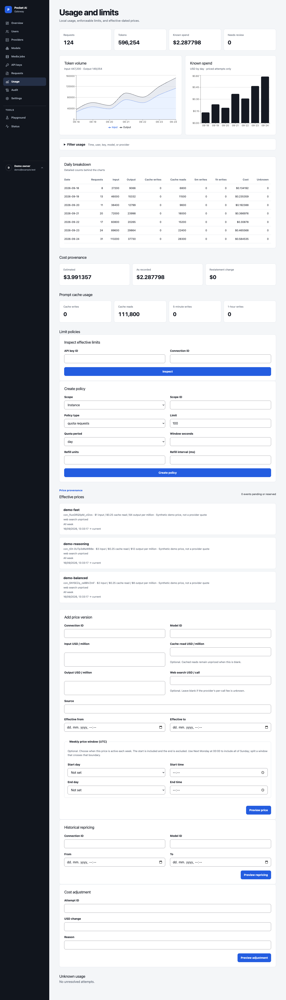](../images/demo-page-usage.png)<br>Daily charts, cache use, and versioned prices explain the fixture's accounting. |

| Request history | Request detail |
| --- | --- |
| [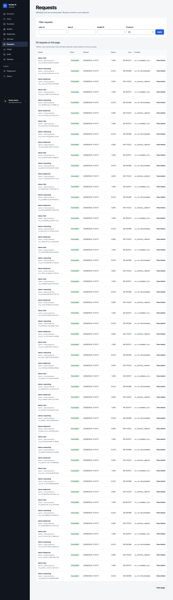](../images/demo-page-requests.png)<br>The list shows traffic generated through the gateway and local mock provider. | [](../images/demo-page-request-detail.png)<br>A request detail traces attempts, token use, and its example cost. |

### Gateway setup

| Providers | Models |
| --- | --- |
| [](../images/demo-page-providers.png)<br>Three mock connections keep the demo offline. | [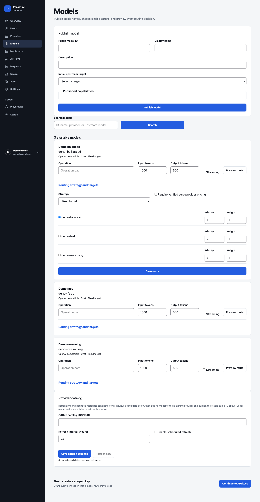](../images/demo-page-models.png)<br>Public model names route to mock upstream targets. |

| API keys | Media jobs |
| --- | --- |
| [](../images/demo-page-keys.png)<br>The owner's example key shows its grants without exposing the secret value. | [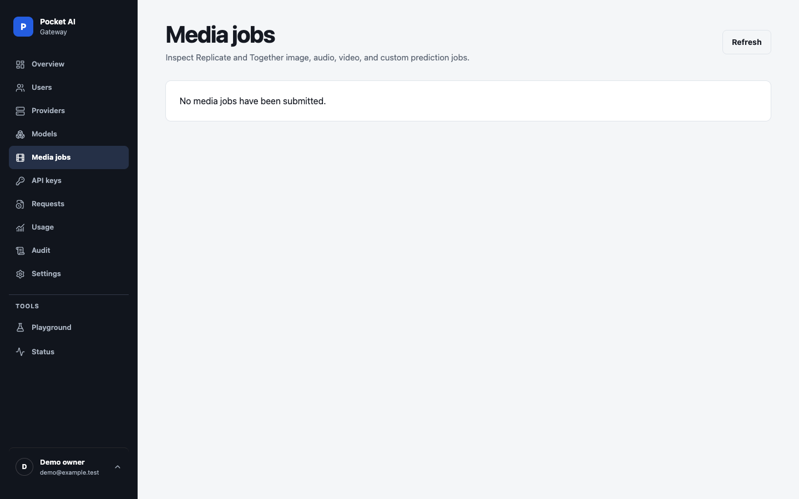](../images/demo-page-media-jobs.png)<br>No media jobs are seeded; submitted jobs would appear here. |

| Playground |
| --- |
| [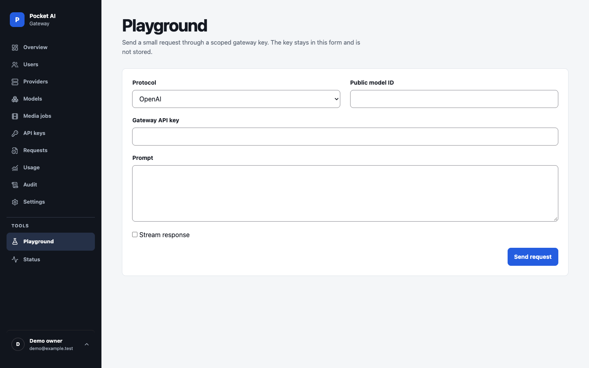](../images/demo-page-playground.png)<br>The playground provides a request form for a published model. |

### Operations and access

| Users | Audit log |
| --- | --- |
| [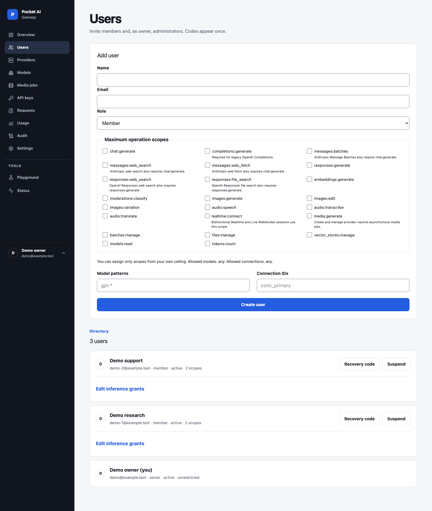](../images/demo-page-users.png)<br>The users view contains three disposable accounts. | [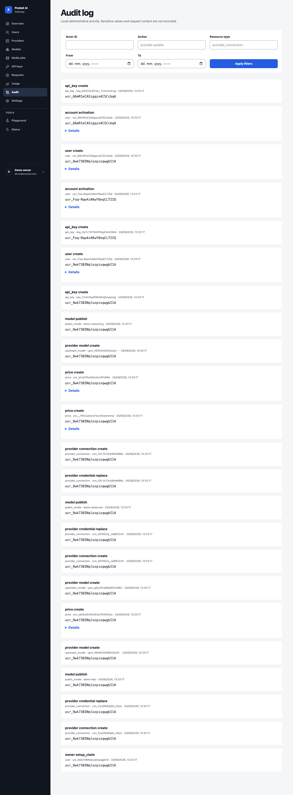](../images/demo-page-audit.png)<br>Audit records trace configuration changes. |

| Settings and recovery | Status |
| --- | --- |
| [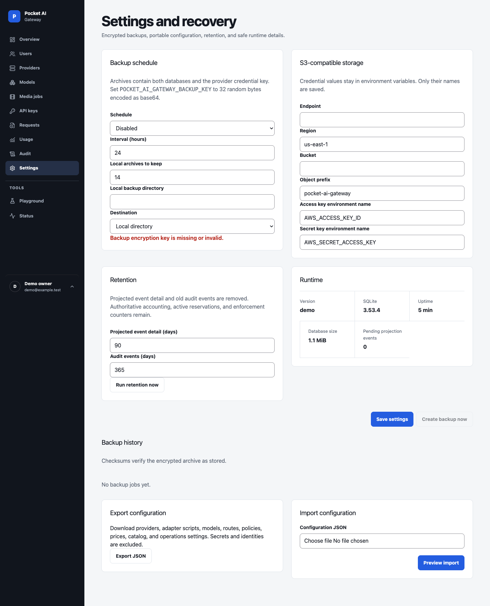](../images/demo-page-settings.png)<br>Backup is disabled in this demo because no archive encryption key is configured; recovery controls remain visible. | [](../images/demo-page-status.png)<br>Status combines readiness and local runtime diagnostics. |

| Account |
| --- |
| [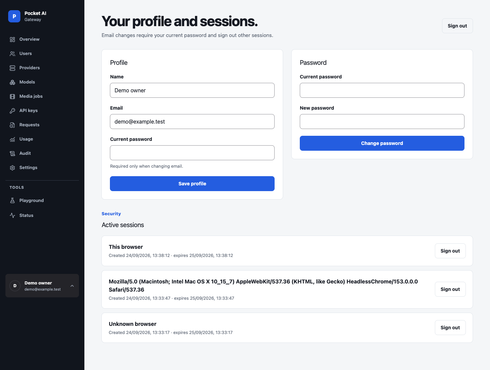](../images/demo-page-account.png)<br>The account page lets the signed-in owner manage their profile and sessions. |

### Mobile

The same demo at 390 pixels wide, with complete pages rather than cropped viewports.

| Overview | Status |
| --- | --- |
| [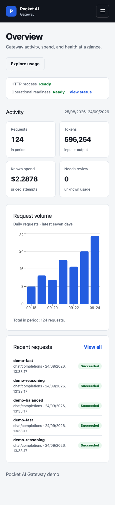](../images/demo-mobile-overview.png) | [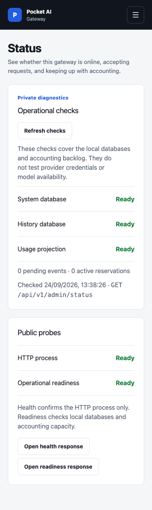](../images/demo-mobile-status.png) |

The [full mobile usage page](../images/demo-mobile-usage.png) and [full mobile request list](../images/demo-mobile-requests.png) are long, so open them at full size.

## Isolation and cleanup

The runner always creates a new temporary directory. It accepts no data-directory option and ignores `POCKET_AI_GATEWAY_DATA_DIR`, so it cannot seed an existing installation. Its dashboard and mock provider listen on loopback. Seeding makes no calls to external AI providers and uses no real provider credentials. The build may download dependencies when needed.

Stop with Ctrl+C to close the servers and delete the temporary databases and keys. Demo changes disappear when the process stops. Do not add real credentials, expose this development instance publicly, or use its data as a production backup. The production executable contains no demo command or automatic seed behavior.

## Verify the fixture

```sh
go test ./scripts/demo -count=1
```

The test checks loopback-only seeded endpoints, successful sign-in, request/token/cost totals, seven daily buckets, projected history, temporary-directory cleanup, and that an existing operator directory stays untouched.

Verified September 24, 2026: the rebuilt single executable served the disposable demo and all 18 full-page captures above. The capture script checked populated pages, headings, runtime status, PNG dimensions, and horizontal overflow at 1440- and 390-pixel widths. The local quick verification gate passed. The demo has no external provider credentials or media jobs; its backup warning reflects the absence of a demo backup key.

To reproduce the gallery, start `./scripts/demo.sh`, then run `PAG_DEMO_PASSWORD=<printed temporary password> node scripts/capture-demo-screenshots.mjs`. The [capture manifest](../images/demo-screenshots.json) records each image's viewport and full-page height.
