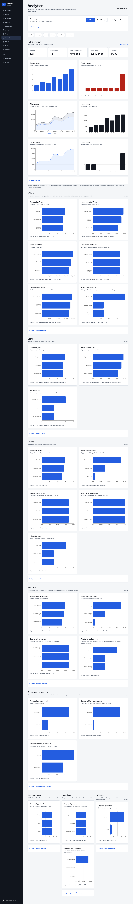
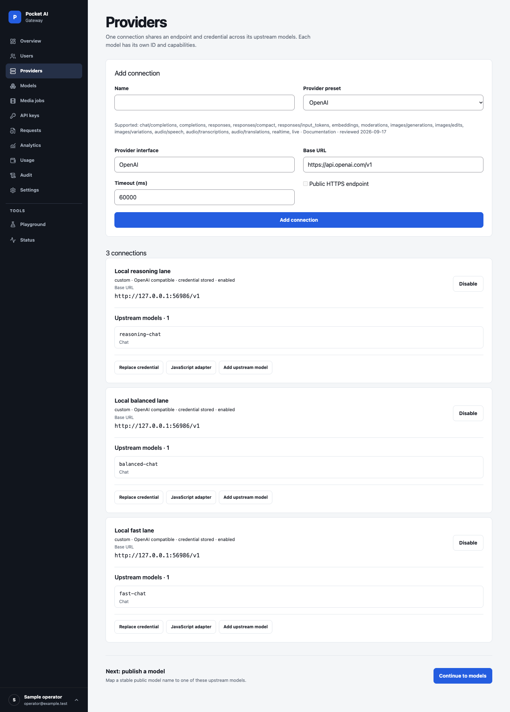
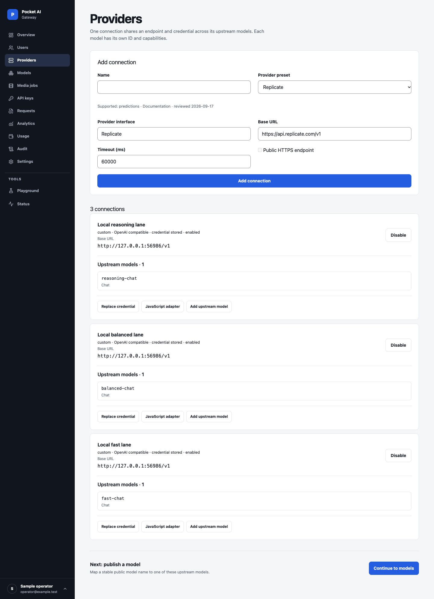

# Try the dashboard with example data

From a source checkout with the [build prerequisites](deployment.md#build-once-deploy-one-executable), run:

```sh
./scripts/demo.sh
```

The command builds the embedded dashboard and starts an example instance at `http://127.0.0.1:18084/_/`. Sign in with `operator@example.test` and the temporary password printed in the terminal. Use `./scripts/demo.sh --port 0` to select an available port automatically.

The disposable instance contains three example users, three local mock provider connections, three public models, three scoped keys, illustrative token prices, and 124 requests across seven days: 112 succeed and 12 fail. The latest hour has six failures among 31 requests, so the error chart and local alert are visible. Requests use the real gateway authorization, routing, accounting, and history projection paths; the loopback mock supplies responses and token counts. Timestamps are shifted only inside the fixture to populate the charts. Prices and usage are examples, not provider quotes or performance measurements.

## Screenshots

Every image is a complete page of the embedded dashboard: 1440 pixels wide on desktop and 390 on mobile. Each capture resizes the browser to the page's full height, so the sidebar and its account menu render as a user sees them. Every account, provider, key, request, and price comes from the disposable example instance. Prices are examples, not provider quotes.

Select an image to open the full-resolution capture.

### Traffic and cost

| Overview | Analytics |
| --- | --- |
| [](../images/demo-page-overview.png)<br>Requests, error rate, tokens, known spend, and recent requests. | [](../images/demo-page-analytics.png)<br>Daily trends and ranked charts, including p95 duration and time to first byte by model and by streaming or synchronous mode. |

| Usage and limits | Request history |
| --- | --- |
| [](../images/demo-page-usage.png)<br>Daily accounting, limits, and versioned prices explain the example cost. | [](../images/demo-page-requests.png)<br>Each request shows its duration, response mode, and time to first byte. |

| Request detail | Failed requests |
| --- | --- |
| [](../images/demo-page-request-detail.png)<br>Attempts, token use, timing, and the example cost. | [](../images/demo-page-request-errors.png)<br>The same history filtered to final failures. |

| Failed request detail |
| --- |
| [](../images/demo-page-failed-request.png)<br>A failed request keeps its attempt and cost provenance without capturing the prompt. |

### Gateway setup

| Providers | Models |
| --- | --- |
| [](../images/demo-page-providers.png)<br>Each local connection shows its base URL and upstream models. | [](../images/demo-page-models.png)<br>Public model names route to mock upstream targets. |

The preset pages below are unsubmitted forms filled from the backend preset catalog. Selecting a preset does not create a connection or call the provider.

| OpenAI preset | Replicate preset |
| --- | --- |
| [](../images/demo-page-providers-preset-openai.png)<br>The reviewed base URL and supported operations. | [](../images/demo-page-providers-preset-replicate.png)<br>The prediction-lifecycle preset for Replicate models. |

| API keys | Media jobs |
| --- | --- |
| [](../images/demo-page-keys.png)<br>Keys show their grants without exposing secret values. | [](../images/demo-page-media-jobs.png)<br>No media jobs are seeded; submitted jobs would appear here. |

| Playground |
| --- |
| [](../images/demo-page-playground.png)<br>A request form for a published model. |

### Operations and access

| Users | Audit log |
| --- | --- |
| [](../images/demo-page-users.png)<br>Three disposable accounts. | [](../images/demo-page-audit.png)<br>Audit records trace configuration changes. |

| Settings and recovery | Status |
| --- | --- |
| [](../images/demo-page-settings.png)<br>Backups are off because no archive encryption key is configured. | [](../images/demo-page-status.png)<br>Readiness, runtime diagnostics, and a recent-error alert. |

| Account |
| --- |
| [](../images/demo-page-account.png)<br>The signed-in owner's profile and sessions. |

### Mobile

The same pages at 390 pixels wide.

| Overview | Status |
| --- | --- |
| [](../images/demo-mobile-overview.png)<br>Metrics stack into a single column. | [](../images/demo-mobile-status.png)<br>Checks and alerts on a small screen. |

The [mobile analytics page](../images/demo-mobile-analytics.png), [usage page](../images/demo-mobile-usage.png), and [request list](../images/demo-mobile-requests.png) are long, so open them at full size.

## Isolation and cleanup

The runner always creates a new temporary directory. It accepts no data-directory option and ignores `POCKET_AI_GATEWAY_DATA_DIR`, so it cannot seed an existing installation. Its dashboard and mock provider listen on loopback. Seeding makes no calls to external AI providers and uses no real provider credentials. The build may download dependencies when needed.

Stop with Ctrl+C to close the servers and delete the temporary databases and keys. Demo changes disappear when the process stops. Do not add real credentials, expose this development instance publicly, or use its data as a production backup. The production executable contains no demo command or automatic seed behavior.

## Verify the fixture

```sh
go test ./scripts/demo -count=1
```

The test checks loopback-only seeded endpoints, sign-in, successful and failed requests across three client protocols, the recent alert window, token/cost totals, seven daily buckets, projected history, temporary-directory cleanup, and that an existing operator directory stays untouched.

All 24 full-page captures were regenerated from scratch on September 25, 2026: 19 desktop and 5 mobile. The capture also checks that the desktop account menu stays anchored in a 700-pixel-tall viewport. Before capturing, the browser verifies the expected synthetic counts and loopback-only mock connections. It also checks populated pages, errors, the local alert, a key-filtered request link after Refresh, headings, PNG dimensions, and no horizontal overflow at 1440- and 390-pixel widths. The instance has no external provider credentials or media jobs; its backup warning reflects the absence of a backup key.

To reproduce the gallery, start `./scripts/demo.sh`, then run `PAG_DEMO_PASSWORD=<printed temporary password> node scripts/capture-demo-screenshots.mjs`. The [capture manifest](../images/demo-screenshots.json) records each image's capture dimensions and viewport where applicable.
