# Try the dashboard with example data

From a source checkout with the [build prerequisites](deployment.md#build-once-deploy-one-executable), run:

```sh
./scripts/demo.sh
```

The command builds the embedded dashboard and starts a demo at `http://127.0.0.1:18084/_/`. Sign in with `demo@example.test` and the temporary password printed in the terminal. Use `./scripts/demo.sh --port 0` to select an available port automatically.

The demo contains three synthetic users, three mock provider connections, three public models, three scoped keys, illustrative token prices, and 124 requests spread across seven days. Requests pass through the real gateway authorization, routing, accounting, and history projection paths; the local mock supplies the text and token counts. Timestamps are shifted only inside the disposable fixture to populate the charts. The prices and usage are examples, not provider quotes or performance measurements.

## Screenshots

Captured from the embedded dashboard using only disposable demo data. The users, providers, keys, requests, and costs in these images are synthetic.

### Analytics

#### Overview


The home screen summarizes the fixture's request and spend totals.

#### Usage summary

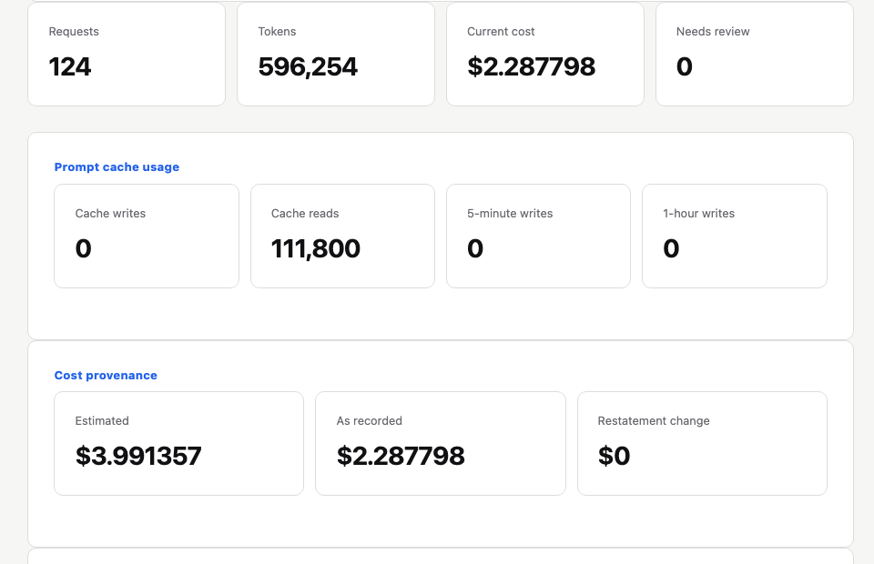

Summary cards show request and token totals alongside cache usage and example cost provenance.

#### Seven-day chart

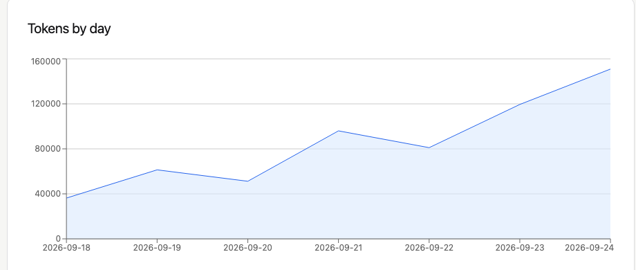

The chart shows daily token usage across the seven-day fixture.

#### Effective prices

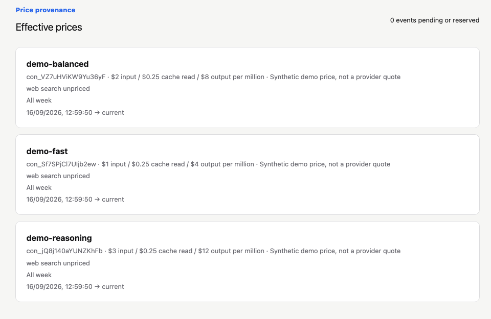

Versioned example prices explain the cost calculation; they are not provider quotes.

#### Request history

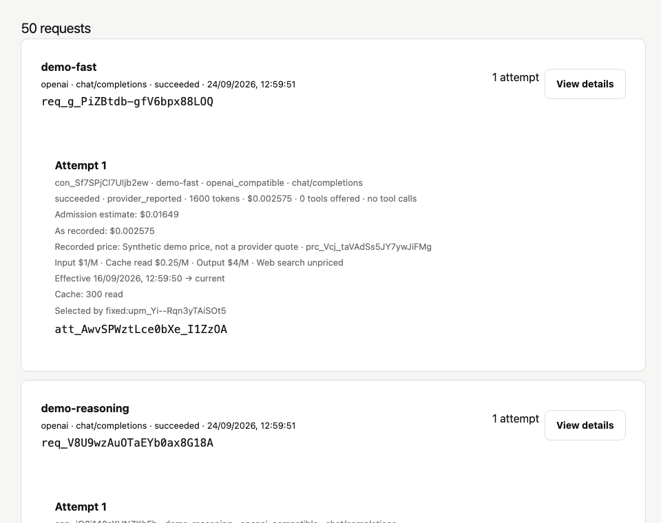

The first page shows traffic generated through the real gateway paths and local mock provider.

#### Request detail

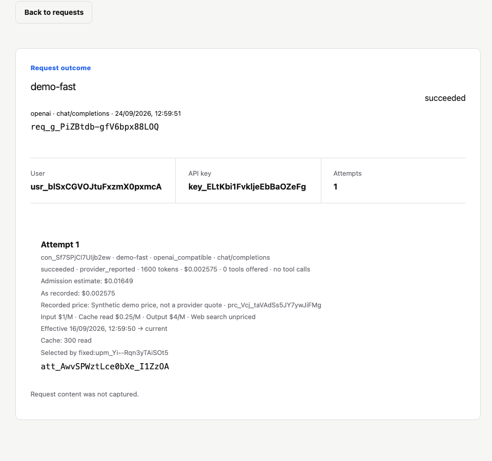

The detail view traces an example request through its attempts, token accounting, and cost record.

### Gateway configuration

#### Providers

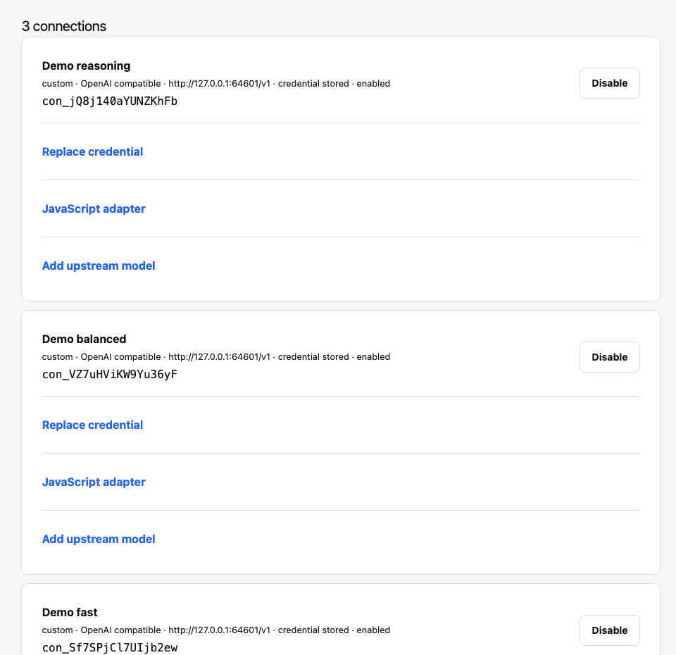

Three mock provider connections let the demo run without external credentials.

#### Models

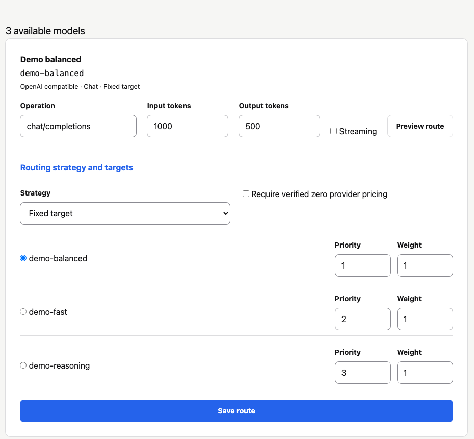

Published model names route to the demo's mock provider targets.

#### API keys

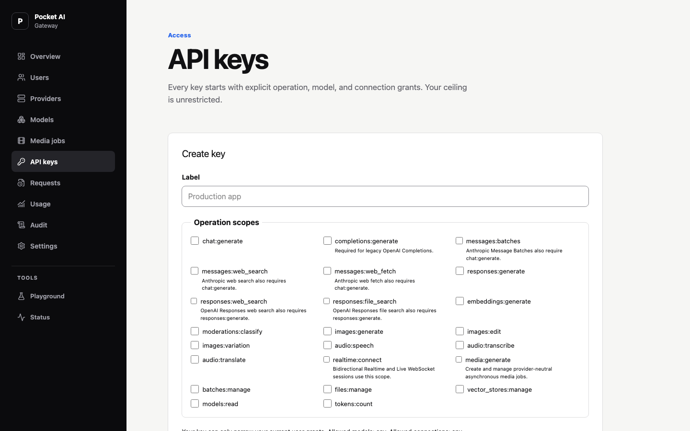

The creation form shows explicit operation scopes without exposing secret values.

#### Key management

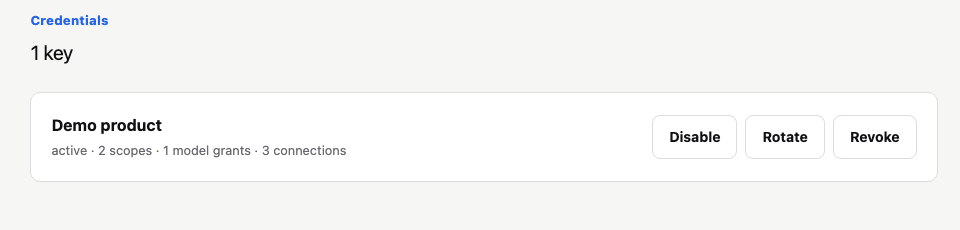

An existing demo key shows its grant counts and lifecycle actions.

### Administration

#### Users

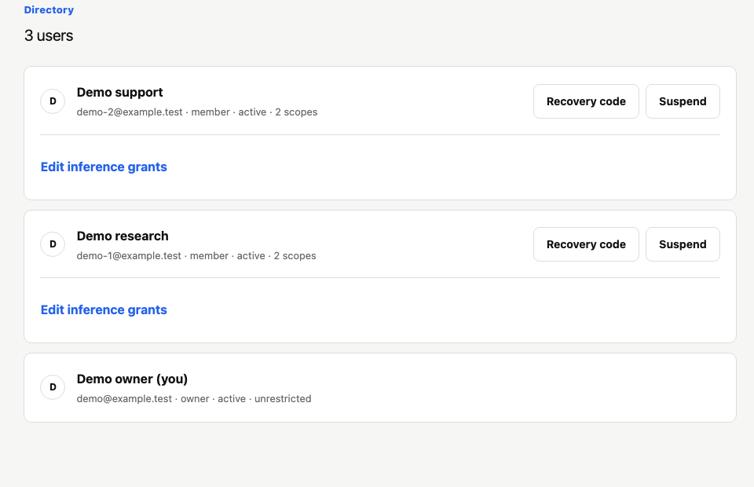

The users view contains three disposable accounts.

#### Audit

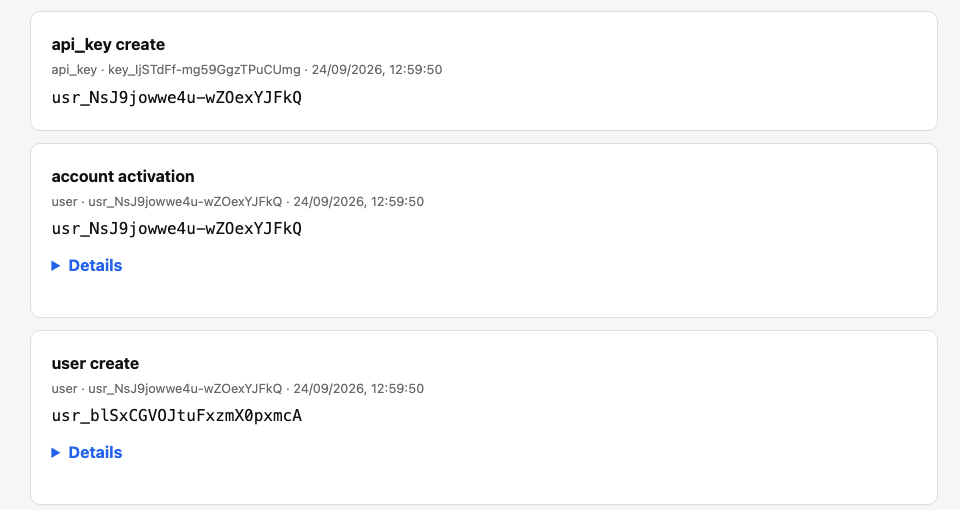

Audit records make configuration changes traceable.

#### Settings

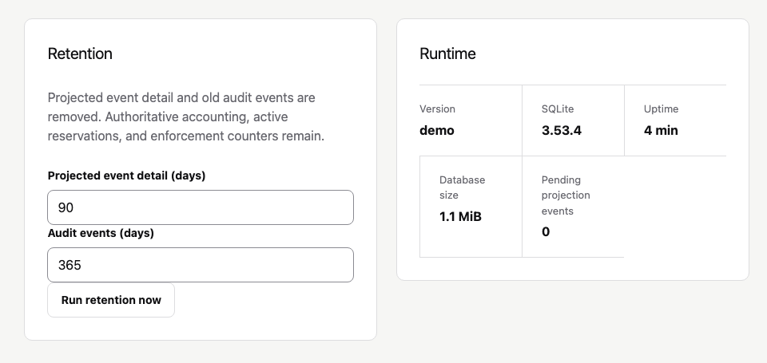

Instance settings collect local operating controls.

#### Status

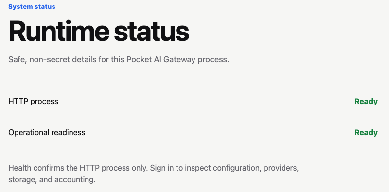

The status view shows instance health and diagnostics.

## Isolation and cleanup

The runner always creates a new temporary directory. It accepts no data-directory option and ignores `POCKET_AI_GATEWAY_DATA_DIR`, so it cannot seed an existing installation. Its dashboard and mock provider listen on loopback. Seeding makes no calls to external AI providers and uses no real provider credentials. The build may download dependencies when needed.

Stop with Ctrl+C to close the servers and delete the temporary databases and keys. Demo changes disappear when the process stops. Do not add real credentials, expose this development instance publicly, or use its data as a production backup. The production executable contains no demo command or automatic seed behavior.

## Verify the fixture

```sh
go test ./scripts/demo -count=1
```

The test checks loopback-only seeded endpoints, successful sign-in, request/token/cost totals, seven daily buckets, projected history, temporary-directory cleanup, and that an existing operator directory stays untouched.

Verified September 22, 2026: the launcher built and served the embedded dashboard, sign-in displayed 124 requests and 596,254 synthetic tokens, and the usage chart rendered at 360-, 768-, and 1280-pixel widths without page overflow. Stopping the launcher removed the temporary instance. The demo exposed and helped verify a chart-sizing fix: the responsive chart now fills its existing 300-pixel container.
